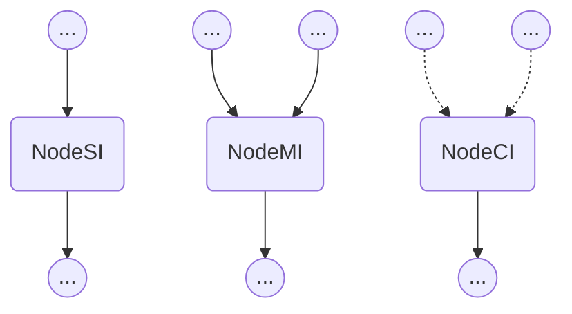
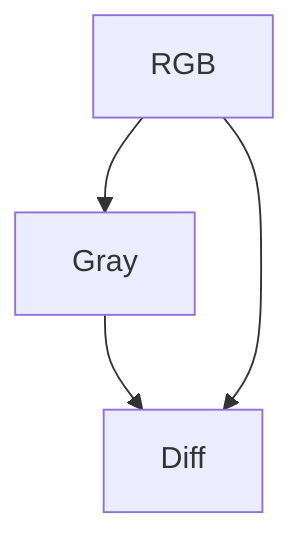

> Why don't you say that three times, 'Within cells interlinked'?
> 
> Within cells interlinked.
> 
> Within cells interlinked.
> 
> Within cells interlinked.


# Cellink 引擎简介

Cellink 引擎是驱动“责任链模式”（Chain of Responsibility Pattern）编程的一套代码（以下简称 Cellink）。责任链模式编程具有诸多优势，其中最突出的，是实现各模块间的解耦。关于责任链模式编程互联网上有很多内容，这有篇很棒的博客可供参考：[责任链模式]([责任链模式 | 菜鸟教程](https://www.runoob.com/design-pattern/chain-of-responsibility-pattern.html)) 。

### 设计动机

**人是视觉动物！** 人类 80% 的日常活动都仰仗视觉（在开发者的工作中比重可能会更高）。Cellink 允许可视化你的项目。无需另行维护，Cellink 能绘制各任务模块间的关系。让我举例说明情况。以下流程图来自三个用 Cellink 管理的项目：

项目一：


项目二:


项目三:


以我所在的计算机工业视觉领域，来阐述 Cellink 的使用场景。一般来说，计算机视觉项目由多个子模块构成（很多项目亦如此），其中有些负责数据解析和格式化，有些负责图像的预处理，另一些则负责算法推断。

很多业务场景要求把原始图像分割成多个 ROI 区域，每个区域做单独处理。比如手机的外观检测中，某些业务模块只关注充电口附近的缺陷。因此需要把充电口附近的像素提取出来，作预处理以后，再传给特定算法模块检测。

通常会差分成如下步骤：1) 载入原始手机图片，2) 定位出手机所在的图像区域，3) 在此基础上继续分割出充电口附近的像素，4) 算法模块执行检测任务。

以上的每个步骤都能抽象成“节点”（有关“节点”的更多细节，我们会在下面章节介绍），每个节点执行后会产生相应的数据传给下一个节点执行。

这套以节点来封装工作任务的流程，就是“责任链模式”编程的内涵。

Cellink 提供了一套简单的机制来管理各节点的流向，确保正确的执行次序。更重要的是，Cellink 能绘制节点间的关系图（如上所示），让开发者看清楚自己所开发的任务模块处于项目中什么位置。这种空间上的知觉让我在项目实践中获得了极大的把控感。哪怕面对历史久远的项目，也不会迷失在代码的迷雾中。

#### 关于 Cellink 的一些限制

编写开发文档、维护项目流程图是优秀程序员的必备技能。在某些中大型项目中，项目流程在架构设计阶段就已明确，因此 Cellink 的绘图功能似乎显得多余。但 Cellink 流程图由项目代码生成，真实反映了当前代码的运行逻辑。一方面能可视化开发进度，另一方面，也能协助开发者及时发现代码与设计流程图冲突之处。

截止目前（2022年9月），Cellink 只在我们团队有限的实践中发挥了作用，而这些项目的规模都不大。我们尚不清楚它是否能被有效推广到大型，或者某些特殊项目（比如有很多并行需求的程序）中。

此外， Cellink 还有编程语言的限制。因为极端依赖 Python 的某些特性（比如装饰器），目前 Cellink 只支持用 Python 开发的项目。但我们期待后续能在更多编程语言的领域实现突破。

### 工作原理

Cellink 通过搭建“有向无环图”（DAG）对项目流程进行建模。任务模块是有向无环图的节点。所有节点都能直接访问父节点的内容。

Cellink 支持几种简单的图操作（比如遍历，广播，和路径搜索等等），以此实现子任务们按正确次序执行。

## 基本概念介绍

### 节点

“节点”是 Cellink 的基本类型（**也是唯一的类型**）。根据不同的输入类型，Cellink 提供了 3 种节点的类定义：

```python
class NodeSI # 单输入节点（Single Input）
class NodeMI # 多输入节点（Multiple Inputs）
class NodeCI # 条件輸入节点（Conditional Inputs）
```

下图是这 3 种节点的可视化结构展示（gitlab 可能渲染有问题，可以用 markdown 工具打开）。



- **NodeSI**：只有一个父节点。访问父亲节点调用``self.parent``
- **NodeMI**：挂载一个或多个父节点；访问父节点调用``self.parent_list[id]``，其中父亲节点的 id 从 0 开始
- **NodeCI**：和 NodeMI 类似，支持挂载多个父节点。区别在于，NodeMI 仅当所有父节点都能执行，自己才能执行。而 NodeCI 只要一个父节点能执行就能执行

#### 节点的搭建

下代码展示了如何搭建一个 NodeSI 节点：

```python
from cellink import NodeMI

class Diff(NodeMI):
    def __str__(self):
        return 'diff'
```

#### 父节点的访问

节点访问父节点的接口如下：

- **parent**：NodeSI 类型的父节点引用
- **parent_list**：NodeMI 和 NodeCI 类型的父节点引用列表

注意：无法执行的父节点在 NodeCI 中的引用为 None（例如 self.parent_list[1] == None）。

### 图

“图”由节点组成。节点与父节点的衔接用装饰器 ``@hook_parent`` 来实现。Cellink 的内部机制确保了由节点构成的图一定是有向无环图。下面代码展示了如何用节点搭建一个图：

```python
from cellink import NodeSI
from cellink import NodeMI
from cellink import hook_parent

class RGB(NodeSI):
    @classmethod
    def from_image_path(cls, image_path):
        att = cls()
        att.img = cv2.imread(image_path)
        return att

@hook_parent(RGB)
class Gray(NodeSI):
    def __str__(self):
        return 'gray'

    def forward(self): # 前向操作：利用父节点的内容来获得自己的变量（aka. 预处理过程）
        self.img = rgb2gray(self.parent.img)
        self.pts = self.parent.pts
        self.cls = self.parent.cls
        return True

@hook_parent(RGB, Gray):
class Diff(NodeMI):
    def __str__(self):
        return 'diff'

    def forward(self):
        rgb_img  = self.parent_list[0].img  # 父节点 RGB 的实例图片
        gray_img = self.parent_list[1].img  # 父节点 Gray 的实例图片
        self.img = np.abs(rgb_img.astype('float32') - gray_img[:,:,None])
        return True
```

由上面代码定义的图可以用 Cellink 绘制出来：



## 你的责任：需要重载的方法

定义节点类型时需要重载 3 个方法：

1. **\_\_str\_\_**：创建节点名称。可以缺省，缺省时返回类名

2. **forward**：承载当前节点的业务逻辑。通常是加工父节点内容，生成自己的内容

3. **backward**：和 forward 方法类似，承载当前节点的特殊业务逻辑（在计算机视觉项目中映射坐标很有用）

我们一一展开介绍。

### 1. 节点名称 \_\_str\_\_：

每个节点都应该有一个区别于其它节点的名称，该名称通过重载 \_\_str\_\_ 方法来定义：

```python
class Rocket(NodeSI):
    def __str__(self):
        return 'rocket'
```

### 2. 前向处理 forward：

forward 方法是定义和当前节点图像和标注信息预处理操作的方法。

forward 方法返回一个 boolean 值，用于告知后台该处理是否成功。如果操作失败，则返回 False

**除了根节点的 forward 方法不需要自定义外（根节点的内容赋值一般由类方法来完成，可参见上面代码中的 from_image_path）**，其它所有节点的 forward 方法都应该由开发者重载：

```python
class Diff(NodeMI):
    def forward(self):
        rgb_img  = self.parent_list[0].img
        gray_img = self.parent_list[1].img
        self.img = np.abs(rgb_img.astype('float32') - gray_img[:,:,None])
        return True
```

### 3. 反向处理 backward：

backward 方法定义了节点的标注信息（缺陷位置和缺陷类别）往上一层节点反向传播时的操作。

和 forward 方法一样，backward 方法也返回一个 boolean 值，用于告知后台该处理是否成功。如果操作失败，则返回 False

**除了根节点的 backward 方法不需要自定义外**，其它所有节点的 backward 方法都应该由开发者重载：

```python
class Diff(NodeMI):
    def backward(self):
        self.parent_list[0].pts = self.pts
        self.parent_list[0].cls = self.cls
        return True
```

## Cellink 的使用接口

网络上的节点有几个公共的方法，可以执行各种图相关的操作。

### 前向搜索 seek：

seek 方法用于执行从根节点沿路上到某节点的 forward 方法：

```python
rgb = RGB.from_image_path('test.jpg')  # 实例化根节点会引发实例化整个网络
diff = rgb.seek('diff')  # 连续执行沿路各节点的 forward() 方法，直到 Diff 节点（返回该节点实例）

plt.imshow(diff.img)  # 因为 diff.forward() 已经在上一步被执行，diff.img 存在内容
plt.show()
```

seek 方法可以从任意一个节点出发到达途中任意一个节点（包括它自己）。

如果由于某种原因无法 seek 到某节点（可能由于某处 forward 失败返回空值），则 seek 方法返回 None

### 反向搜索 retr：

retr 方法（retrospect，取“回顾”之意）用于执行从当前节点沿路上到某节点的 backward 方法。该方法通常用于回溯当前节点坐标到某上游节点坐标的位置：

```python
gray = root['gray']
gray.pts = [[33,100,94,423], [53,16,312,50]] # 为节点的缺陷坐标赋值；等号右边可以是网络输出的 bboxes
gray.cls = ['hello', 'world'] # 为节点的缺陷坐标赋值；等号右边可以是网络输出的 classname

# from gray node retrospect to root
root = gray.retr('rgb')
print(root.pts, root.cls)
```

如果由于某种原因无法 retr 到某节点（可能由于某处 backward 失败返回空值），则 retr 方法返回 None

retr 方法也可以不输入节点名称，此时 retr 会从当前节点处沿路向上运行所有父节点的 backward 方法，直到去无可去。此时 retr 返回 None：

```python
gray.retr()
print(root.pts, root.cls)
```

### 索引操作：\_\_getitem\_\_()

可以通过像字典一样，从任意一个节点出发索引到途中任意一个节点：

```python
diff = root['diff']
gray = diff['gray']
```

**注意**：和 seek 方法不同，索引操作不会触发沿途的 forward 方法。

### 广播操作：broadcast()

该方法数读取一个字典类型，可以向所有节点广播该消息，并从 self.broadcasting （字典类型）中读取：

```python
root.broadcast({'greet': 'good morning!'})
print(gray.broadcasting['greet'])  # output: good morning!
gray.broadcast({'greet': 'good evening!'})
print(root.broadcasting['greet'])  # output: good evening!

# 更简单的广播方法：
root.broadcasting['greet'] = 'good evening!'
print(gray.broadcasting['greet'])  # output: good evening!
```

这个机制可以用于节点间的通信，有时候在节点间跨级传输信息很有用处。

### 遍历操作：traverse()

遍历方法允许开发者遍历所有节点，并对每个节点执行制定的 callback 函数，并**以列表的形式**返回 callback 函数的输出：

```python
str_node_pairs = diff.traverse(lambda node: (str(node), node)) # 返回 callback 函数的输出列表
str2node = dict(str_node_pairs)
root = str2node['rgb']
```

该操作不会出发触发沿途的 forward/backward 方法。

### 节点可视化：show()

可视化当前节点的内容：

```python
diff = root.seek('diff')
diff.show() # 可视化当前节点内容
```

该函数也可以由开发者自定义重载。

### 网络可视化：draw_graph()

画出整个网络：

```python
root.draw_graph() # 画出整个网络
```

**注意：需要安装 graphviz 库（pip install graphviz）和工具（i.e. apt install graphviz）。**

## 装饰器的用法

Cellink 定义了两种装饰器：``hook_parent`` 和 ``static_initializer``

### 挂载父节点装饰器：hook_parent

``hook_parent`` 是类装饰器，用于定义子节点时定义该节点的父节点。该装饰器输入一个或多个节点的类定义，可以为当前节点挂载一个或多个父节点：

```python
@hook_parent(ParentClass)
class ChildClass(NodeSI):
    def forward(self):
        parent_node = self.parent
        ...

@hook_parent(MotherClass, FatherClass)
class ChildClass(NodeMI): # 挂靠多个父节点时，当前节点应该继承 NodeMI 基类
    def forward(self):
        mother_node = self.parent_list[0]  # parent_list 的实例类别次序和装饰器输入类别次序一致
        father_node = self.parent_list[1]  # parent_list 第二个元素是 FatherClass 的类实例
        ...
```

### 静态初始化装饰器：static_initializer

``static_initializer`` 是函数装饰器，用于（静态）初始化某些类变量。

设计这个装饰器的初衷是为了适应某些只用到部分网络的场景。对于复杂的项目来说，整个网络的搭建可能会涉及到一些大型模块的加载（比如分割神经网络用来切割工作面）。对于某些只用到部分简单预处理（部分网络节点）的场景，加载用不到的模块会导致程序启动很慢。所以为了解决这个问题，我们通常要避免在节点类中直接加载大型模型，否则网络初始化的时候这些模型就会被加载。但是我们也不能在初始化函数 ``__init__`` 中加载这些模型，否则每处理一个新数据样本模型都会被加载一遍（因为新样本数据从根节点的类方法输入，该类方法会重建整个网络的所有实例）。 

一个兼顾两者灵活性的方案是：

1. 加载时间长的大型外部模型隶属类方法，所以无论处理多少样本只加载一次

2. 第一次加载发生在调用它们的时候，之后的调用只使用之前加载过的模型实例

装饰器 ``static_initializer`` 提供了这样的灵活性：

```python
class Bumps(NodeSI):
    @static_initializer
    def initialize_bump_finder(self, gpu_id=0):  # 该函数在整个进程生涯中只执行一次
        from lib.BumpFinder import Controller
        bump_finder = Controller(gpu_id=gpu_id) # 耗时操作
        return bump_finder

    def forward(self):
        img = self.parent.img
        # 整个进程周期中，除了第一次调用会执行函数内容，往后的调用都只是返回第一次加载进来的模型的引用
        bump_finder = self.initialize_bump_finder()
        bump_crops, bump_bboxes = bump_finder(img)
```

装饰器 `static_initializer` 保证被装饰函数在整个进程周期中只调用一次，往后的调用都只是返回第一次加载进来的模型的引用。

## Cellink 进阶功能

Cellink 面向熟练的使用者提供更高级的一些特性，下面章节会一一介绍。

### 量子节点

量子节点的概念来自量子力学中的纠缠态。Cellink 允许开发者构建量子节点，用同一份代码处理不同输入的节点。如以下代码所示：

```python
class A(NodeSI):
    def __str__(self):
        return 'A'
    def forward(self):
        self.val = 12
        return True

class B(NodeSI):
    def __str__(self):
        return 'B'
    def forward(self):
        self.val = 2
        return True


@hook_parent([A, B])
class Square(NodeSI):
    def __str__(self):
        return 'B'
    def forward(self):
        val = self.parent.val
        self.val = val * val
        return True
```

以上代码中，节点 A 和 B 被 节点 Square 以特殊的方式挂接，即：```@hook_parent([A, B])```。hook_parent 装饰器里的两个节点被包含在方括号中，当成一个父亲节点被节点 Square 挂接（注意节点 Square 的类型是单输入节点 NodeSI）。我们称这样的挂接方式叫做“量子挂接”，类似 Square 这样的节点我们叫做量子节点。因为 Square 挂载了两个节点，我们称 Square 节点的**量子态为2** 。普通节点也可以看作是量子态为 1 的特殊量子节点。

量子节点通常包含多个节点的内容，它们往往共享同一种操作。在运行 seek 方法时，Cellink 会根据不同的节点输出选择相应的路径和量子节点的内容进行操作：

```python
@hook_parent((Square, 1))
class BSquare(NodeSI):
    def __str__(self):
        return 'BSquare'
    def forward(self):
        self.val = self.parent.val
        return True

if __name__ == '__main__':
    node = A()
    node = node.seek('BSquare')
    print(node.val)
```

上面代码展示了如何从量子节点“坍缩”回普通节点。秘诀在```@hook_parent((Square, 1))```里的括号操作符。该操作符用```(ClassName, int)```的方式表示，左边的元素是父亲节点的类名（父亲为量子节点的情况下），右边是一个大于等于 0 的整数，代表量子节点中的第几个量子态。括号里的 ‘Square’ 代表该节点所挂接的父亲节点类型，‘1’ 表示要析取 Square 节点中的第二个量子态，即节点 B 的平方节点。

以上代码的运行结果是 4 。

### 关于量子节点的更多说明

装饰器 hook_parent 中的```[]```和```()```操作符并没有给 Cellink 的使用带来更多的复杂度。这两者的使用是灵活而且随意的，只要遵循以下规则：

#### 不支持嵌套：

类似 ```@hook_parent([([Node0, Node1], 1), Node2], Node3)```的操作是不允许的

#### 父类的量子态数量需相等：

```python
@hook_parent(Node1, Node2, [Node3, (Node4, 3)])
class NodeNew(NodeMI):
    ...
```

上面代码中，NodeNew 有 3 个父亲节点，每个父亲节点的量子态数量必须一致。但这种情况也不是绝对的。我们运行量子态的广播机制（类似于 numpy 里的 dimension broadcasting）。比如 Node2 和 Node1 就可以是普通节点。它们会自动复制并扩展成量子态与```[Node3, (Node4, 3)]```匹配的量子节点。
