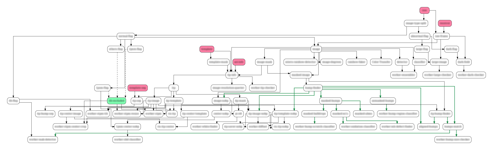
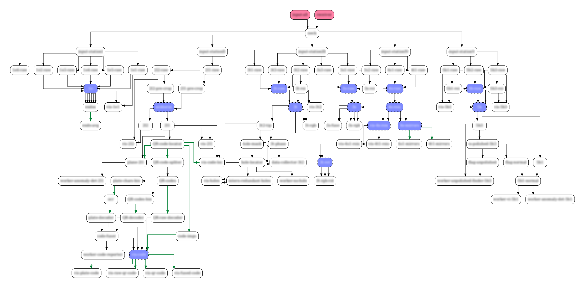
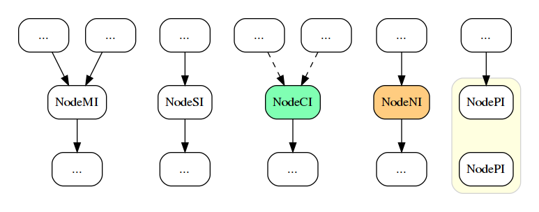

> Why don't you say that three times, 'Within cells interlinked'?
> 
> Within cells interlinked.
> 
> Within cells interlinked.
> 
> Within cells interlinked.

# Cellink 引擎简介

Cellink 引擎是驱动“责任链模式”（Chain of Responsibility Pattern）编程的一套代码（以下简称 Cellink）。责任链模式编程具有诸多优势，其中最突出的，是实现各模块间的解耦。关于责任链模式编程互联网上有很多内容，这有篇很棒的博客可供参考：[责任链模式](https://www.runoob.com/design-pattern/chain-of-responsibility-pattern.html) 。


## 设计动机

**人是视觉动物。** 健康人类 80% 的日常活动都依赖视觉（在开发者的工作中比重可能会更高）。Cellink 允许可视化你的项目。无需另行维护，Cellink 能绘制各任务模块间的关系。让我试举例说明情况。以下流程图来自我的三个项目，它们都用 Cellink 管理：

项目一：


项目二:


项目三:


以计算机工业视觉领域为例，来阐述 Cellink 的使用场景。一般来说，计算机视觉项目由多个子模块构成（很多其它项目亦如此），其中有些负责数据解析和格式化，有些负责图像预处理，另一些则负责算法推断。

很多业务场景要求把原始图像分割成多个 ROI 区域，每个区域做单独处理。比如手机的外观检测，某个业务模块只关注充电口附近的缺陷。需要先把充电口附近的区域提取出来，作预处理以后，再传给特定算法模块检测。

通常会差分成如下步骤：1) 载入原始手机图片，2) 定位出手机所在的图像区域，3) 在此基础上继续分割出充电口附近的像素，4) 算法模块执行检测任务。

以上的每个步骤都能抽象成“节点”（有关“节点”的更多细节，我们会在下面章节介绍），每个节点执行后会产生相应的数据传给下一个节点执行。

这套以节点来封装工作任务的流程，就是“责任链模式”编程的内涵。

Cellink 提供了一套简单的机制来管理各节点的流向，确保正确的执行次序。更重要的是，Cellink 能绘制各节点的关系图（如上所示），让开发者看清楚自己所开发的任务模块处于项目中什么位置。这种空间上的知觉让我在项目实践中获得了极大的把控感。哪怕面对历史久远的项目，也不会在代码的迷雾中迷失。

### 工作原理

Cellink 通过搭建“有向无环图”（DAG）对项目流程进行建模。任务模块是有向无环图的节点。所有节点都能直接访问父节点的内容。

Cellink 支持几种简单的图操作（比如遍历，广播，和路径搜索等等），以此实现各子任务按正确次序执行。

### Cellink 的局限

编写开发文档、维护项目流程图是优秀程序员的必备技能。在某些中大型项目中，项目流程在架构设计阶段就已明确，因此 Cellink 的绘图功能似乎显得多余。但 Cellink 流程图由项目代码生成，真实反映了当前代码的运行逻辑。一方面能可视化开发进度，另一方面，也能协助开发者发现代码与设计流程图冲突之处。

截止目前（2022年9月），Cellink 只在我们团队有限的实践中发挥了作用，而这些项目的规模都不大。我们尚不清楚它是否能被有效推广到大型、或某些特殊的项目中（比如有很多并行需求的程序）。

此外， Cellink 还受编程语言的限制。因为极端依赖 Python 的某些特性（比如装饰器），目前 Cellink 只支持用 Python 开发的项目。但我们期待后续能在更多编程语言上取得突破。


## 基本概念介绍

### 一、节点

“节点”是 Cellink 的基本类型（**也是唯一类型**）。根据不同的输入类型，Cellink 提供了 3 种节点的类定义：

```python
class NodeSI # 单输入节点（Single Input）
class NodeMI # 多输入节点（Multiple Inputs）
class NodeCI # 条件輸入节点（Conditional Inputs）
```

下图是这 3 种节点的可视化结构展示：



- **NodeSI**：只有一个父节点
- **NodeMI**：挂载一个或多个父节点
- **NodeCI**：和 NodeMI 类似，挂载多个父节点。区别在于，执行 NodeMI 的条件是所有父节点都能执行；而 NodeCI 只要任一父节点能执行就行


#### 创建节点

Cellink 通过继承节点类来创建新节点。下代码展示如何创建一个 NodeSI 节点：

```python
from cellink import NodeMI

class Diff(NodeMI):
    def __str__(self):
        return 'diff'
```


#### 访问父节点

子节点可以通过类变量来访问父节点：

- **parent**：NodeSI 类型的父节点
- **parent_list**：NodeMI 和 NodeCI 类型的父节点列表（之所以不叫 parents 是怕拼写上容易与 parent 混淆）

父节点列表 parent_list 还有以下两点特性：

1. 父节点在 parent_list 中的次序与被挂载时的次序相同。有关父节点的挂载，下个章节会介绍
2. 如果 NodeCI 的某个父节点无法执行，那么对应 parent_list 元素的值为 None


#### 根节点

没有任何父节点的节点叫根节点。一个项目里可以有多个根节点。

根节点可选择继承 NodeSI/NodeMI/NodeCI 中的任何一个，Cellink 不做限制。

根节点一般是整个项目的数据入口。我们发现，用类方法（@classmethod）实例化根节点是比较好的实践：

```python
class Root(NodeSI):
    @classmethod
    def initialize(cls, val):
        root = cls()
        root.val = val
        return root

root = Root.initialize(42)
```


### 二、图

“图”由节点组成。子节点用装饰器 ``@hook_parent`` 挂载父节点。Cellink 的内部机制确保了图的有向无环结构。

下面代码展示了如何用 3 个节点搭建一个简单的图：

```python
from cellink import NodeSI
from cellink import NodeMI
from cellink import hook_parent

class RGB(NodeSI): # 此为根节点（没有父节点），可继承任何节点类型
    @classmethod
    def from_image_path(cls, image_path):
        att = cls()
        att.img = cv2.imread(image_path)
        return att

@hook_parent(RGB)
class Gray(NodeSI):
    def __str__(self):
        return 'gray'

    def forward(self):
        rgb_img = self.parent.img  # 通过 self.parent 访问父节点
        self.img = rgb2gray(rgb_img)
        return True

@hook_parent(RGB, Gray)
class Diff(NodeMI):
    def __str__(self):
        return 'diff'

    def forward(self):
        rgb_img  = self.parent_list[0].img  # 访问父节点 RGB
        gray_img = self.parent_list[1].img  # 访问父节点 Gray
        self.img = np.abs(rgb_img.astype('float32') - gray_img[:,:,None])
        return True
```

上面代码由 Cellink 绘制的流程视图如下：


**当一个节点被实例化时，图中的所有其它节点都会被实例化，于是它所在的图也完成了实例化：**

```python
rgb = RGB() # 此时其它两个节点的实例也会随着被实例化
rgb.draw_graph() # 节点被实例化时，图也跟着被实例化
```


## 创建节点

新建节点时需要要重载 3 个方法：

1. **\_\_str\_\_**：创建节点名称。可缺省

2. **forward**：前向处理方法。可缺省

3. **backward**：反向处理方法。可缺省

我们一一展开介绍。


### 1. 节点名称 \_\_str\_\_：

节点的名称通过重载 \_\_str\_\_ 方法来定义：

```python
class Rocket(NodeSI):
    def __str__(self):
        return 'rocket'
```

注：发现重名节点 Cellink 会报错。


### 2. 前向处理 forward：

Cellink 提供从所有根节点到目标节点的前向路径搜索，沿途节点的 forward 方法会被依次调用。

forward 方法承载当前节点的业务逻辑。通常需要访问并处理父节点的内容，生成自己的内容。

forward 方法返回一个 boolean 值，用于通知 Cellink 本节点是否执行成功。

forward 方法缺省时默认返回 False（根节点返回 True）。

虽然 Cellink 不做限制，我们不建议开发者在 forward 方法中修改父节点的内容。

**需要注意的是，我们假定 forward 方法中的业务逻辑很耗时，所以该方法只会被执行一次！！！**

**需要注意的是，我们假定 forward 方法中的业务逻辑很耗时，所以该方法只会被执行一次！！！**

**需要注意的是，我们假定 forward 方法中的业务逻辑很耗时，所以该方法只会被执行一次！！！**

以下是 forward 方法的一个示例：

```python
@hook_parent(RGB, Gray)
class Diff(NodeMI):
    def forward(self):
        rgb_img  = self.parent_list[0].img
        gray_img = self.parent_list[1].img
        self.img = np.abs(rgb_img.astype('float32') - gray_img[:,:,None])
        return True
```


### 3. 反向处理 backward：

Cellink 提供从当前点到目标节点的反向路径搜索，沿途节点的 backward 方法会被依次调用。

和 forward 方法一样，backward 方法也返回一个 boolean 值，用于通知 Cellink 本节点的反向操作是否执行成功。

backward 方法缺省时默认返回 False 。

backward 方法比较常见的业务实践是对父节点的内容进行修改。

backward 方法对机器视觉领域的业务很有帮助，在我们的项目实践中，通常被用于反向传播缺陷的坐标。因为每一步操作只需在局部坐标系上变换，极大简化了编程实现的复杂度。

**如果没有反向传播信息的业务需求，backward 方法可以缺省。**

以下是 backward 方法的一个示例：

```python
class ScaleAndTranslate(NodeMI):
    def backward(self):
        scale = self.scale 
        x0, y0 = self.offset
        x, y = self.coordinate
        self.parent.coordinate = (x / scale + x0, y / scale + y0)
        self.parent.classname = self.classname
        return True
```


## 使用 Cellink

Cellink 支持几种简单的图操作（比如遍历，广播，和路径搜索等等）。这些操作都通过调用节点中的方法/变量实现。


### 前向搜索 seek：

seek 方法用于执行从所有根节点到目标节点的前向路径搜索。沿路上所有节点的 forward 方法都会被执行：

```python
rgb = RGB.from_image_path('test.jpg')  # 实例化根节点会引发实例化整个网络
diff = rgb.seek('diff')  # 连续执行沿路各节点的 forward() 方法，直到 Diff 节点（返回该节点实例）

plt.imshow(diff.img)  # 因为 diff.forward() 已经在上一步被执行，diff.img 存在内容
plt.show()
```

seek 方法输入目标节点的名称（该名称通过 \_\_str\_\_ 方法定义），返回目标节点的实例。

如果出于某种原因目标节点无法被执行（可能沿途某处节点的 forward 方法执行失败返回了 False），seek 方法返回 None 。

seek 方法可以被任意节点调用，其返回结果不变：

```python
node1 = rgb.seek('diff')
node2 = node1.seek('diff')
assert node1 == node2
```


### 反向搜索 retr：

retr 方法（retrospect，取“回顾”之意）用于执行从当前点到目标节点的反向路径搜索，沿途节点的 backward 方法会被依次调用：

```python
gray = root['gray']
gray.pts = [[33,100,94,423], [53,16,312,50]] # 为节点的缺陷坐标赋值；等号右边可以是网络输出的 bboxes
gray.cls = ['hello', 'world'] # 为节点的缺陷坐标赋值；等号右边可以是网络输出的 classname

# from gray node retrospect to root
root = gray.retr('rgb')
print(root.pts, root.cls)
```

如果出于某种原因目标节点无法被执行（可能沿途某处节点的 forward 方法执行失败返回了 False），retr 方法返回 None

retr 方法可以不输入节点名称，此时 retr 会从当前节点沿路运行所有祖先节点的 backward 方法，直到所有根节点。此时 retr 方法也返回 None：

```python
gray.retr()
print(root.pts, root.cls)
```


### 索引操作：\_\_getitem\_\_()

该方法可以索引图中任一节点：

```python
diff = root['diff']
gray = diff['gray']
```

**注意**：和 seek 方法不同，索引操作不触发沿途的 forward 方法。


### 广播操作：broadcast()

该方法数读取一个字典类型作为信息，并向所有节点广播。其它节点可以从 self.broadcasting （字典类型）中读取：

```python
root.broadcast({'greet': 'good morning!'})
print(gray.broadcasting['greet'])  # output: good morning!
gray.broadcast({'greet': 'good evening!'})
print(root.broadcasting['greet'])  # output: good evening!

# 更直接的广播方法：
root.broadcasting['greet'] = 'good evening!'
print(gray.broadcasting['greet'])  # output: good evening!
```

广播机制用于节点间快速通信，类似全局变量。

一般不建议滥用广播机制。


### 遍历操作：traverse()

traverse 方法以 callback 函数为输入，该 callback 函数以节点实例为输入，由开发者定义。

traverse 遍历图中所有节点，并对以每个节点为输入执行 callback 函数。最后返回 callback 函数的执行结果列表：

```python
str_node_pairs = diff.traverse(lambda node: (str(node), node)) # 返回 callback 函数的输出列表
str2node = dict(str_node_pairs)
root = str2node['rgb']
```

traverse 方法不触发沿途的 forward/backward 方法。

traverse 方法遍历节点的次序是无规则的。


### 网络可视化：draw_graph()

draw_graph 方法绘制流程视图（如上图）。

**注意：需要同时安装 graphviz 库（pip install graphviz）和工具（apt install graphviz）。**

```python
root.draw_graph() # 画出整个网络
```


## 装饰器说明

Cellink 定义了两种装饰器：``@hook_parent`` 和 ``@static_initializer``


### 挂载装饰器 @hook_parent

@hook_parent 是类装饰器，用于挂载父节点。@hook_parent 输入一个或多个节点的类定义：

```python
@hook_parent(ParentClass)
class ChildClass(NodeSI):
    def forward(self):
        parent_node = self.parent
        ...

@hook_parent(MotherClass, FatherClass)
class ChildClass(NodeMI): # 挂靠多个父节点时，当前节点应该继承 NodeMI 基类
    def forward(self):
        mother_node = self.parent_list[0]  # parent_list 的实例类别次序和装饰器输入类别次序一致
        father_node = self.parent_list[1]  # parent_list 第二个元素是 FatherClass 的类实例
        ... 
```


### 静态初始化装饰器 @static_initializer：

@static_initializer 是函数装饰器，用于（静态）初始化节点的类变量。设计该装饰器是为了给项目加速 。

很多深度学习的项目需要加载 AI 模型，该操作通常很耗时。普遍的做法是在初始化阶段一次性完成加载。但我们希望 Cellink 能赋予更多灵活性：

1. 只有被 seek 到时，相关节点的模型才会被加载

2. 在程序的生命周期中，模型不会被重复加载

为了不失一般性，“模型加载”可以看做任何开销昂贵的初始化操作。

以下代码展示了 @static_initializer 的用法

```python
class Image():
    ...

@hook_parent(Image)
class Bump(NodeSI):
    def __str__(self):
        return 'bump'

    @static_initializer
    def initialize_bump_finder(self):  # 该函数在整个进程生涯中只执行一次
        bump_finder = Controller(gpu_id=0) # 加载 AI 模型，耗时操作
        return bump_finder

    def forward(self):
        img = self.parent.img
        # 在程序的生命周期中，只有第一次调用会执行该函数的内容，
        # 往后的所有调用只返回第一次调用返回的内容
        bump_finder = self.initialize_bump_finder()
        bump_bboxes = bump_finder(img)

img1 = Image.from_image_path('IMAGE1.JPG')
bump = img1.seek('bump')  # 加载 AI 模型，耗时 2s

img2 = Image.from_image_path('IMAGE1.JPG')
bump = img2.seek('bump')  # 模型不会被二次加载，可以直接使用
```

装饰器 `static_initializer` 保证被装饰函数在整个进程周期中只调用一次，往后的调用都只是返回第一次加载进来的模型的引用。


## Cellink 实践

本小节介绍几个 Cellink 的编程实践。一些是我们设计 Cellink 时的需求，另一些则是在 Cellink 的使用过程中被意外发现的。

“噢，原来我们可以如此这般 ......”，有时候完全超出了我们当初对 Cellink 的预想。我们也希望 Cellink 更多奇妙的用法被挖掘出来。


### 实践一：用不同的图实例处理不同的数据

Cellink 的唯一类型就是节。当一个节点被实例化时，它所在的图中所有其它节点都会被实例化。所以一个节点被实例化，整个图也会被实例化。

实例化整个图只搭建节点的框架，所以哪怕有上千个节点，搭建一个图的计算开销也是非常小的（相比真正的业务需求）。

节点的 forward 方法在整个节点的生命周期中只会被执行一次，因此改变根节点的输入数据并不会改变其它节点的输出。如果要处理不同数据（比如检测不同图片上的目标），我们建议搭建不同的图来处理：

```python
# 处理第一个数据
rgb1 = RGB.from_image_path('IMAGE1.JPG')
diff1 = rgb1.seek('diff')

# 建立新的图，处理第二个数据
rgb2 = RGB.from_image_path('IMAGE2.JPG')
diff2 = rgb2.seek('diff')
```


### 实践二：大胆托管你的实验代码

和业务无关的代码亦可放入图中作为节点托管（比如项目开发过程中的实验代码）。得益于 Cellink 对业务流的精确控制，这些非业务节点在正式的工作流程中永远不会执行。

当然如果你介意流程视图变得杂乱，可以选择定期清理一些非业务节点。


### 实践三：重视中间结果的展示

漂亮的可视化展示对梳理业务逻辑往往很有帮助。可以为每个重要的节点实现 dump 或 show 方法，用于打印或可视化节点内容。这在调试和回顾代码的时候通常很有用。我们甚至经常创建专门的可视化节点来展示另一些节点的内容。就如前一小节提到的那样，不要因此而担心拖累运行速度（因为那不会发生）。


### 实践四：运用 Flag 节点

我们有时候会创建一些 Flag 节点来充当控制业务流的条件。比如某节点必须满足 A 条件（比如说某个节点的变量大于 0 ）才能运行，那 A 条件就可以抽象出一个节点。这样的节点我们叫 Flag 节点：

``` python
@hook_parent(Number)
class FlagA(NodeSI): # 条件 A 抽象出的节点
    def forward(self):
        return self.parent.val >= 0
    
@hook_parent(Number, FlagA)
class Sqrt(NodeMI):
	def forward(self):
        val = self.parent_list[0].val
        self.val = np.sqrt(val)
        return True
```

上面代码中，Sqrt 节点没有访问 FlagA 的内容，而是利用 Cellink 前向搜索的特性把 A 条件作用在自己身上。

如果条件 A 很重要，那么把它抽象出来成为 Flag 节点的好处是业务逻辑的可视化（在流程视图上）。


### 实践五：Worker 节点与 Neck 节点

worker 节点和 neck 节点来自项目实践，并非 Cellink 定义的特殊节点。本小节介绍如何借助优雅地借助这两种节点完成检测任务。

- **worker 节点**：worker 节点都是叶子节点，名称以 'worker-' 开头。worker 节点通常是产生检测结果的地方，比如手机充电孔处的缺陷检测模块，此时 worker 节点的检测结果在局部坐标。迁移到全局坐标需要把局部坐标反向传播到根节点上（见 backward 方法和 retr 方法）
- **neck 节点**：作为数据入口的根节点可以不直接面向各业务节点，而通过 neck 节点代理分发数据。这样做的好处是方便 neck 节点在 backward 方法中收集所有 worker 节点反向传播回来的结果信息

下面代码展示了如何优雅地运行所有 worker 节点并收集它们的检测信息：

``` python
class InputNode(NodeSI):
    ...
    
@hook_parent(InputNode)
class Neck(NodeSI):
    ...
    def backward(self):
        if not hasattr(self.parent, 'results'):
            self.parent.results = self.results
        else:
            # 累积从不同 worker 节点反向传播回来的检测信息
            self.parent.results.extend(self.results)

# 运行所有 worker 节点，把结果反向传播并累积到根节点
if __name__ == '__main__':
    root = InputNode.load_data(data)

    def _execute(node):
        if str(node).startswith('worker-'):
            if node.seek(str(node)):
                node.retr()

    # 运行所有 worker 节点的前向执行与结果的反向传播
    root.traverse(_execute)
    results = root.results
```


### 实践六：在节点中使用 Cellink

如果某个节点的业务很复杂，我们倾向于把它拆解成好几个节点来实现。但有时候这种拆解过于冗余而且与主业务无关（特别是不适合显示在流程视图上），这时会以子模块的方式封装该节点的业务。节点中的子模块可以用另一个 Cellink 驱动，不同层级的 Cellink 不会相互干扰。


## Cellink 进阶

面向熟练使用者，Cellink 提供了一些高级特性。


### 量子节点

借用了量子力学的术语。Cellink 允许开发者构建所谓的“量子节点”。下图中的 Square 节点就是一个量子节点：

```python
class A(NodeSI):
    def forward(self):
        self.val = 12
        return True

class B(NodeSI):
    def forward(self):
        self.val = 2
        return True


@hook_parent([A, B])
class Square(NodeSI):
    def forward(self):
        val = self.parent.val
        self.val = val * val
        return True
```

表面上看，Square 节点与普通节点并无不同，但 Square 节点的“两个父节点”被放在方括号里。

这样的挂载方式在 Square 节点看来只挂载了一个父节点，但自己变成了两个分身。我们称 Square 节点处于**量子态**，它的量子态数量为 2 。

*量子节点实际上是共享一个节点名称和定义的多个节点的集合。*

*某种意义上说，所有普通节点也是量子节点，只不过它们的量子态数量为 1 。*


#### @hook_parent 的完整技能

在更详细地说明量子态之前，请允许我先介绍 @hook_parent 装饰器的高阶技能。

@hook_parent 装饰器完整的输入格式是：

```python
@hook_parent([(Node1, id1), (Node2, id2), ...], ...)
```

@hook_parent 装饰器的每个入参（Argument）表示一个父节点。入参可以是类定义，或者 tuple 类型，或者一个类定义和 tuple 类型的混合列表（list）。这三种形式都表示一个父节点。

其中 tuple 类型表示“坍缩”操作，用于析取量子节点的量子态。它的第一个元素为节点的类定义，第二个元素为整数，表示希望析取的第几个量子态：

```python
@hook_parent((Node, 1)) # 析取 Node 的第二个量子态作为父节点
@hook_parent((Node, -1) # -1 表示析取 Node 的所有量子态，与 Node 本身等价
```

普通的挂载方式只是在参数格式上的简化：

```python
# 假设 Node1 和 Node2 的量子态数量都为 1
@hook_parent(Node1, Node2, ...)
# 等价于：
@hook_parent([(Node1, 0), (Node2, 0)])
```

@hook_parent 装饰器也支持混合格式：

```python
@hook_parent(Node1, (Node2, 1))
@hook_parent([Node1, (Node2, 2), Node3]， Node4)
```

@hook_parent 装饰器接收参数时的原则只有一个：所有父节点量子态数量须保持一致。

这样做是为了保持父节点量子态之间的对应关系。因为节点的量子态须和父节点的量子态一一对应。

假设一个多输入节点有两个父节点 Node1 和 Node2，那么一般来说 Node1 的量子态必须和 Node2 的相等。

然而也有例外。 @hook_parent 支持类似 numpy 里的 dimension broadcasting 。当量子态为 1 的父节点会自动扩展自己的量子态，与其它父节点的量子态保持一致：

``` python
# 假设 Node1/2/3 都是量子态为 1 的普通节点
# 那以下输入格式也是合法的，因为 Node1 会自动扩展成 [Node1, Node1] 与 [Node2, Node3] 保持一致
@hook_parent(Node1, [Node2, Node3])

# 因为量子态的一一对应关系，上一条语句的效果类似于两个多输入节点挂载不同的父节点组合
@hook_parent(Node1, Node2) # 第一个量子态的等效
@hook_parent(Node1, Node3) # 第二个量子态的等效
```


#### 量子节点的特性

节点的量子态数量和父节点的量子态数量相等。

运行 seek 方法时，Cellink 会根据不同的目标节点选择相应的路径和量子节点的内容进行操作。

在有量子节点的图中，traverse 方法只遍历所有节点的第一个量子态。

seek 量子节点的结果等效于 seek 该节点的第一个量子态。想要 seek 其它量子态，需要创建新节点并在 @hook_parent 装饰器里用“坍缩”操作：

```python
@hook_parent((Square, 1))
class BSquare(NodeSI):
    def forward(self):
        self.val = self.parent.val
        return True

if __name__ == '__main__':
    node = A()
    node = node.seek('BSquare')
    print(node.val)
```

上面代码展示了如何从量子节点“坍缩”回普通节点。@hook_parent((Square, 1)) 表示挂载量子节点 Square 的第二个量子态，即节点 B 的平方节点。

输出结果是 4 。

下图是上面两段代码的流程视图：

